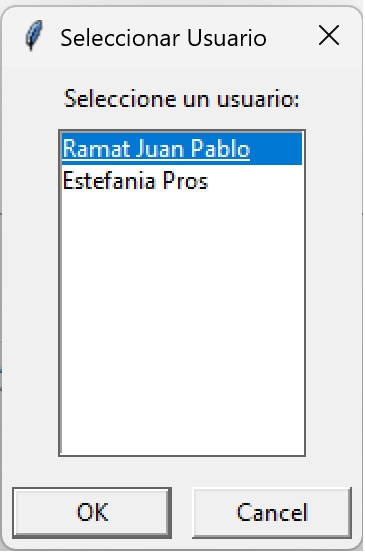
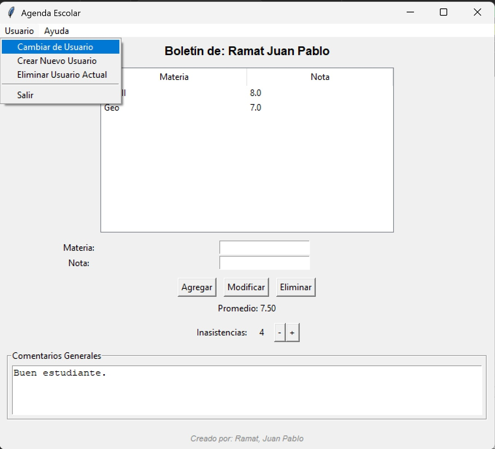
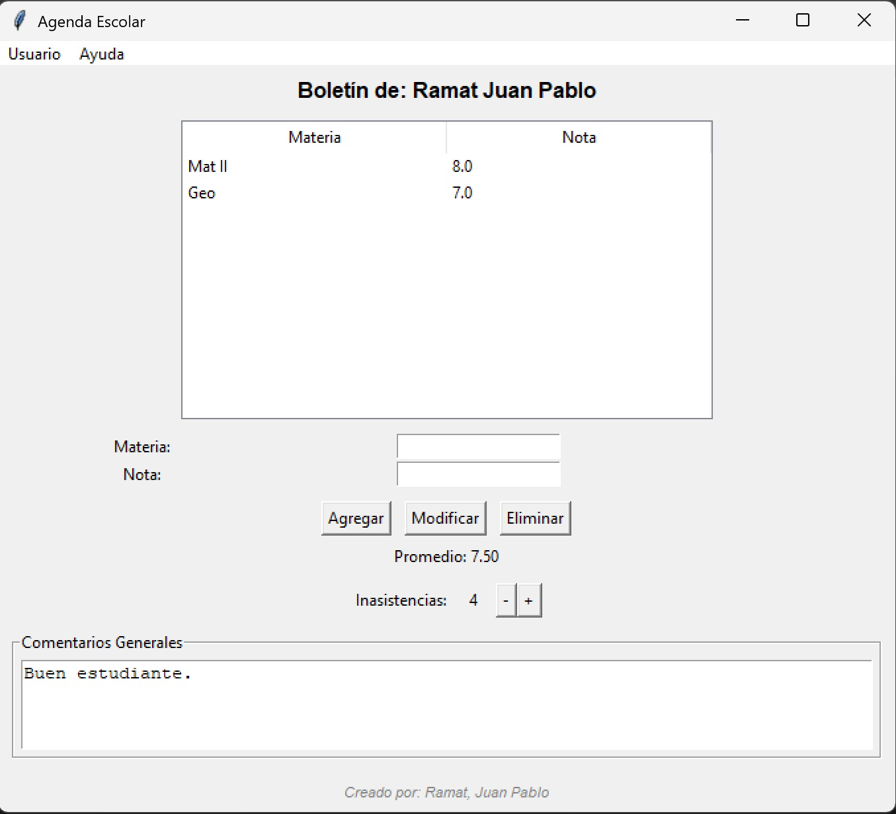

# Agenda Escolar

## Descripción
Agenda Escolar es una aplicación que permite a los usuarios gestionar sus materias y notas de manera sencilla. La aplicación incluye funcionalidades para cargar materias y notas, calcular promedios, y verificar materias aprobadas.

## Estructura del Proyecto
El proyecto está organizado de la siguiente manera:

```
agenda-escolar
├── src
│   ├── main.py          # Punto de entrada de la aplicación
│   ├── ui.py            # Interfaz de usuario
│   ├── data
│   │   └── storage.py   # Manejo de almacenamiento de datos
│   └── utils
│       └── __init__.py  # Funciones utilitarias
├── requirements.txt      # Dependencias del proyecto
├── README.md             # Documentación del proyecto
└── setup.py              # Configuración para empaquetar la aplicación
```

## Requisitos
Para ejecutar la aplicación, asegúrate de tener instaladas las siguientes dependencias. Puedes instalarlas utilizando pip:

```
pip install -r requirements.txt
```

## Uso
1. Clona el repositorio o descarga los archivos.
2. Navega a la carpeta del proyecto.
3. Ejecuta el archivo principal:

```
python src/main.py
```







## Contribuciones
Las contribuciones son bienvenidas. Si deseas mejorar la aplicación, por favor abre un issue o envía un pull request.
